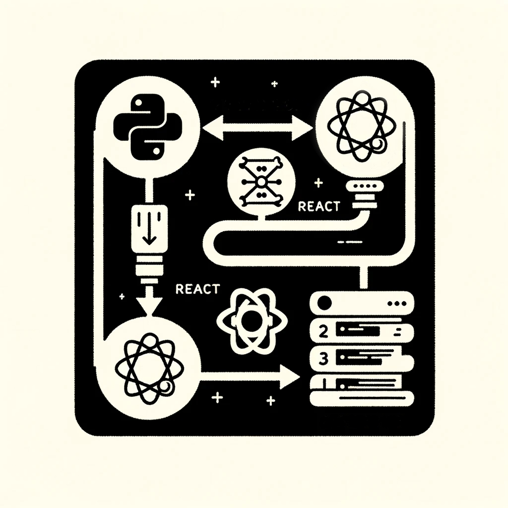

Voice-Activated Chatbot Application

Description:

This Python application integrates various components to create a voice-activated chatbot. It uses speech recognition to interpret spoken input, converts text to speech for audible responses, and leverages the OpenAI GPT-4 model for intelligent and interactive conversation. The application provides an interactive experience where users can speak to the application and receive spoken responses from the chatbot.

Features:

- Speech Recognition: Converts spoken words into text using Google's speech recognition.
- Text to Speech: Converts chatbot responses into spoken words.
- OpenAI Chatbot: Integrates with OpenAI's GPT-4 model to generate conversational responses.
- Trigger Word Detection: The application listens for a specific trigger word to activate the chatbot response.

Requirements:

    * Python 3.x
    * PyAudio
    * SpeechRecognition
    * gTTS (Google Text-to-Speech)
    * playsound
    * OpenAI Python client

Installation:

Ensure Python 3.x is installed on your system.

Install required Python packages in bash terminal

Clone this repository or download the source code.

Configuration:

Obtain an API key from OpenAI and set it in the keys.py file as OPENAI_AUTH_TOKEN.

-Speak into your microphone after the application starts.
-Say the trigger word "application" followed by your message to interact with the chatbot.
-Say "stop" to exit the application.

