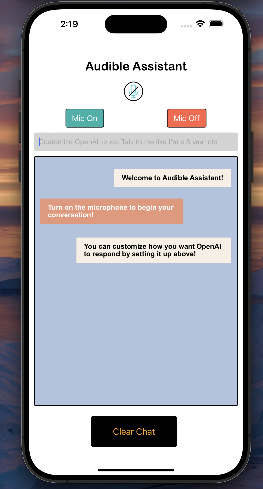

    
    
    
    
    

<table>
  <tr>
    <!-- First Column for the React Native Image -->
    <td>
      
    </td>
    <td>
      
       
      Play at 1.25x speed
    </td>
  </tr>
</table>

Audible Assistant: 

Introduction: 

Welcome to Audible Assistant, a cutting-edge full-stack application that brings the power of voice-activated technology to your fingertips. Leveraging OpenAI's advanced GPT-4 model, Audible Assistant transforms the way you interact with technology through speech.

Features: 

Speech Recognition: Utilizing Google's speech recognition to understand your spoken words.
Text to Speech: Bringing chatbot responses to life with audible speech using Amazon's Polly Text-to-Speech service.
OpenAI Chatbot: Powered by OpenAI's GPT-4 for smart, interactive conversations.

Required Python Dependencies:

    playsound
    openai
    speechrecognition
    pyobjc
    gtts 
    flask
    flask-sqlalchemy 
    sqlalchemy-serializer 
    flask-migrate 
    importlib-resources 
    flask-restful 
    boto3

    

Installation: 

    *Clone this repository or download the source code.
    *Ensure Python is installed.
    *Install required Python packages
    *Install JavaScript/React packages: npm install
    *Install Flask dependencies: pip install Flask
    *Configuration
    *Obtain an OpenAI API key from OpenAI. Set this key in keys.py as OPENAI_AUTH_TOKEN.

How to run Audbile Assistant:

1. Start the Python server: python3 main.py
2. Launch the React app: npm start
3. Run the Flask server: flask --app app.py --debug run -p 5500
->(make sure ports are available on your local machine)

How to Sign In/Sign Up to Audbile Assistant 

1. Click sign in button, this will redirect you to third party authentication page
2. You can sign up using your Apple ID, Google account, or Github account
->After sign up or sign in, you will be redirected to Audible Assistant home page

How to use Audible Assistant:

1. To turn on microphone, click Start Recording button. 
->OpenAI will automatically begin listening for incoming prompts
2. To turn off microphone, click Stop Recording button
->Microphone will shut off, prompting a message "Microphone is turned off"
->Click Start Recording button to turn microphone back on
3. To save your prompts and OpenAIs responses, click Save Data button
4. To retrive your previous prompts and OpenAIs responses, click Fetch Saved Data button
5. To clear the chat box of all prompts and responses, click the Clear Chat button.

